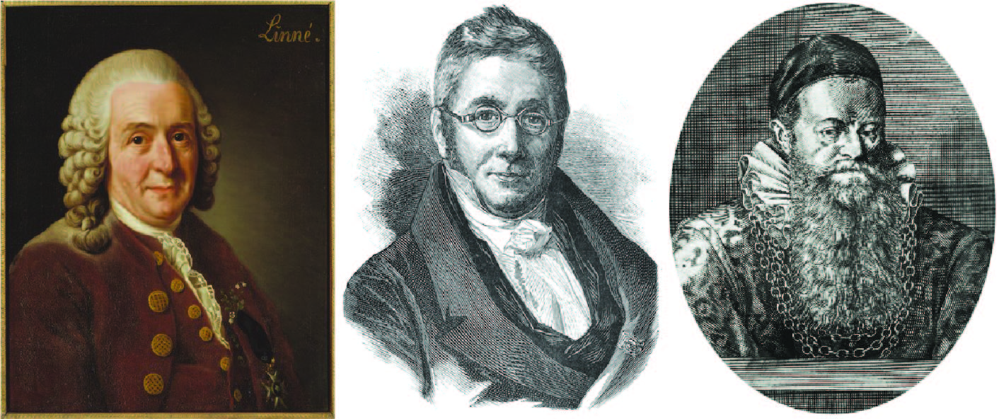

# (PART) Diversity {.unnumbered}

# Biological Classification

## The Living World

```{r echo=FALSE}
knitr::opts_chunk$set(comment = "#>", collapse = TRUE, fig.align = 'center',
			    fig.width = 7, fig.height = 5, out.width = '90%', 
			    echo=FALSE, message=FALSE, warning=FALSE)
```

```{r, echo=FALSE}
colorize <- function(x, color) {
  if (knitr::is_latex_output()) {
    sprintf("\\textcolor{%s}{%s}", color, x)
  } else if (knitr::is_html_output()) {
    sprintf("<span style='color: %s;'>%s</span>", color, 
      x)
  } else x
}
```

Life is a unique, complex organisation of molecules expressing itself through chemical reactions which lead to growth development responsiveness, adaptation and reproduction. Life is recognised by mode of its working which includes some unified and basic characteristics. The important characteristics are:

1.  **Growth:** All living beings grow. Increase in mass and increase in number of cells are twin characters of growth. In unicellular organisms, it can be increase in size and mass, whereas in multicellular, it is increase in the number of cells. The growth takes place by cell division. In plants, the growth by cell division occurs continuously throughout their life span and therefore, is indefinite, whereas in animals this growth is seen only up to a certain age and hence it is definite. Non-living objects also grow if we take increase in body mass as a criterion of growth. Growth therefore, cannot be taken as a defining property of living organisms.

2.  **Reproduction:** The reproduction means to produce progeny possessing features more or less similar to those of the parents. The organisms can reproduce asexually as well as sexually. There are different methods of asexual reproduction in different forms of organisms. Reproduction is synonymous with growth in unicellular organisms i.e., increase in the number of cells is equivalent to reproduction. Further, there are some organisms which do not reproduce at all e.g., Worker bees, mules. Hence, reproduction also cannot be an all-inclusive property of living organisms.

3.  **Metabolism:** All living beings show metabolism. It is defined as sum total of all chemical reactions taking place in the body of an organism. Some of the chemical reactions are constructive and are called as anabolic, whereas others are destructive and are called as catabolic. If anabolism exceeds catabolism, growth takes place.

4.  **Irritability:** All living beings respond to the external stimuli. The response given by an organism to the stimulus is called as Irritability. It Is because of presence of either nervous system or some sensory structures in different forms of life. Thus, consciousness is defining property

## Systematics and Taxonomy

### Diversity of Life

The variety of living organisms on Earth, including plants, animals, bacteria, and fungi, is enormous [@mora2011].

-   Predicted number of total species on earth is 5 to 50 million. Average number is 14 million.
-   It is estimated that there are perhaps 10 million eukaryotic species and an unknown number of prokaryotic ones [@mora2011].
-   According to [Catalogue of Life](https://www.catalogueoflife.org/) Number of taxonomically known species is over 1.83 million.
-   These include nearly 1.2 million animals and over 0.5 million species of plants. Amongst animals, insects form the largest group i.e., over 10,25,000 species. Every year known or discovered number of species is 15,000.

### Need of Classification

Keeping in view vast diversity of living organism, there is a need to classify organisms.

-   Gives an idea about diversity of organisms
-   Throws light into the origin of organisms
-   Gives information about evolutionary Interrelations between organisms
-   By studying one member of a group, a broad idea regarding all organisms of the group can be obtained

### Systematics

The scientific study of this biological diversity and its evolutionary history is called **systematics**.



-   Term given by [Carolus Linnaeus](https://en.wikipedia.org/wiki/Carl_Linnaeus) (Figure \@ref(fig:fig1))
-   Study of diversity of organisms and their comparative and evolutionary relationship.
-   Systematics = Taxonomy + Phylogeny
-   **Phylogeny** is the evolutionary history of organisms
-   Most of the taxonomist believed that both taxonomy and systematics are interchangeable, but **G. Simpson** considered these as separate fields.

### Taxonomy

-   Term by [A. P. de Candolle](https://en.wikipedia.org/wiki/Augustin_Pyramus_de_Candolle) (Figure \@ref(fig:fig1)) -- in his book [*Theorie Elementaire de la Botanique*](https://www.biodiversitylibrary.org/bibliography/39705).
-   Study of principles and procedures of classification of organisms
-   Components of taxonomy are Characterisation, Identification, Nomenclature and Classification
-   Identification is the first step of taxonomy, and is based upon characterisation

### Taxonomic Hierarchy

The placement of organisms to different ranks in a systematic framework of classification. This framework is called taxonomic hierarchy.

-   First given by Linnaeus who introduced 5 ranks i.e.,\
    Class --- order --- genus --- species --- variety (from upper to lower)
-   Later on, modified with 7 obligate categories and about 21 intermediate categories. Seven obligate categories are:\
    Kingdom---Phylum/Division---Class---Order---Family---Genus---Species (from higher to lower)
-   Domain---Kingdom---Phylum/Division---Class---Order---Family---Genus---Species `r colorize("[ICFRE 2020]", "red")`
-   Higher the category; higher the number of organisms and lesser the number of common characters.\
-   Intermediate categories are written with prefix 'super' and 'sub', e.g., superclass; subclass. Intraspecies categories (Intermediate categories)\
    Sub-species/varieties---subvariety---form/race---subform or clone
    
```{r t71}

rbind(
  c("Phylum", "Cuvier"),
  c("Division", "Eichler"),
  c("Class, Order", "Linnaeus"),
  c("Family, Species", "John Ray"),
  c("Genus", "Toumefort"),
  c("Concept of Genus", "Brunfels")
	) |> 
	as.data.frame() |>
	knitr::kable(col.names = c("term (s)", "Author"), 
	             caption = "Terms and their Authors") |>
	kableExtra::row_spec(0, background = "#666", color = "#fff")
```    

-   Taxon is a taxonomic group of real organisms assigned to a category. Category represents rank/level in a hierarchy

## Species Concept and Types

### Species Concept

Species concepts [@dequeiroz2007]

1.  **Morphological/Static/Typological Concept:** By Linnaeus; Species are fixed, Immutable and can be recognised by their morphological features.

2.  **Dynamic Concept of Species:** By Lamarck; Mutable and Changeable

3.  **Biological Concept of Species:** By Ernst Mayr; Based on reproductive Isolation. K. Jordan (1905) first gave the definition, Later Mayr proposed the biological species concept. According to this concept, *"a species is a group of interbreeding natural population that is reproductively isolated from other such groups"*. Exceptions of "Biological Concept of Species" / Reproductive isolation:

| Hybridisation              | Reproductive Potential                     |
|:---------------------------|:-------------------------------------------|
| ♂ Donkey × ♀ Horse = Mule  | Sterile hybrids (under natural conditions) |
| ♂ Horse × ♀ Donkey = Hinny | Sterile hybrids (under natural conditions) |
| ♂ Tiger × ♀ Lion = Tigon   | Fertile hybrids (under captive conditions) |
| ♂ Lion × ♀ Tiger = Liger   | Fertile hybrids (under captive conditions) |

: **(\#tab:hybridisation-type) Exceptions to Biological Concept of Species**

4.  **Evolutionary Species Concept:** Simpson (1961) has proposed that *"an evolutionary species is a lineage (an ancestral- descendant sequence of populations) evolving separately from others and with its own unitary evolutionary role and tendencies"*. Christoffersen (1995) proposed the **ontological species concept** that is *"a species is a single lineage of ancestral descendant sexual populations genetically integrated by historically contingent events of interbreeding"*. This definition of Christoffersen has given stress on the interbreeding nature of a species.

### Species Types

+---------------------+---------------------------------------------------------------------------------+
| Species Type        | Description                                                                     |
+:====================+:================================================================================+
| Morphospecies       | Species erected on the basis of morphological characters                        |
+---------------------+---------------------------------------------------------------------------------+
| Taxonomic species   | Species with binomial name                                                      |
+---------------------+---------------------------------------------------------------------------------+
| Sibling species     | Two different species which are morphologically identical but do not interbreed |
+---------------------+---------------------------------------------------------------------------------+
| Allopatric species  | Species having, exclusive area of geographical distribution                     |
+---------------------+---------------------------------------------------------------------------------+
| Sympatric species   | Species having overlapping areas of geographical distribution                   |
+---------------------+---------------------------------------------------------------------------------+
| Parapatric species  | Species found in narrow overlapping zone                                        |
+---------------------+---------------------------------------------------------------------------------+
| Allochronic species | Species belonging to different time period                                      |
+---------------------+---------------------------------------------------------------------------------+
| Synchronic species  | Species belonging to same time period                                           |
+---------------------+---------------------------------------------------------------------------------+

: **(\#tab:species-type) Major types of Species**

## Nomenclature

**Vernacular names** are the names given in local language, which varies from place to place and language to language. Thus, these names are not universal. On the other hand, **Scientific names** give a universal name to a particular organism on the basis of definite rules and criteria.

1.  **Polynomial nomenclature:** Introduced before 1750, organism's name consists of a series of latinised descriptive words. Such names became lengthy and difficult to learn. e.g., *Caryophyllum saxatilis folis gramineus umbellatis corymbis*. For example, for catnip, which was formally named *Nepeta floribus interrupte spicatus pedunculatis* (meaning "*Nepeta* with flowers in an interrupted pedunculate spike").

2.  **Binomial nomenclature:**

-   First proposed by [Gaspard Bauhin](https://en.wikipedia.org/wiki/Gaspard_Bauhin) (or Caspar Bauhin) in [*Pinax Theatri Botanici (1623)*](https://bibdigital.rjb.csic.es/idurl/1/10754)
-   Introduced by Carolus Linnaeus; Swedish naturalist who changed his name according to binomial nomenclature. His old name was Karl Von Linne.
-   Organism's name consists of two Latin words. First name is generic and second name is species epithet. e.g., Garden pea -- *Pisum sativum* (L). Letter in bracket shows the name of scientist who gave the name.
-   Binomial epithet = genus + species + author's citation
-   Linnaeus gave some principles of the binomial nomenclature in *Philosophia Botanica*, But the nomenclature was use first in *Species Plantarum*, where names and description of 5,900 species of plants were given. Later he published *Systema Naturae*, where 4,326 species of a were described.

3.  **Trinomial nomenclature:**

-   Given by **Lamarck**, it consists of 3 words i.e., genus + species + sub-species or varieties (Table \@ref(tab:t71)).
-   In animal kingdom - third name is subspecies whereas in plantae - it is varieties.

| Vernacular Name | Scientific Name               |
|:----------------|:------------------------------|
| Indian crow     | *Corvus splendens splendens*  |
| Srilankan crow  | *Corvus splendens protegatus* |
| Bunnese crow    | *Corvus splendens insolens*   |
| Cabbage         | *Brassica oleracea capitata*  |

: **(\#tab:t71) Examples of Trinomial Nomenclature**

### Standardisation of Names

-   ICBN (1961): International Code of Botanical Nomenclature (Earlier)
-   ICNafp (2018): International Code of Nomenclature for Algae, Fungi, and Plants `r colorize("[ICFRE 2020; CGPSC 2020]", "red")`
-   ICZN (1964): International Code of Zoological Nomenclature
-   ICNB: International Code for Nomenclature of Bacteria
-   ICNCP: International Code of Nomenclature for Cultivated Plants
-   ICTV: International Committee for the Taxonomy of Virus

### Terminology

-   **Tautonyms:** An organism with same generic and species name. It is not applicable in plants. e.g., *Rattus rattus*.
-   **Autonyms:** When species and subspecies names are same. e.g., *Corvus splendens splendens*.
-   **Synonyms:** When two or more names are given, the first name is recognised as valid name and all other names are called synonyms. e.g., *Albugo candida* (valid name); *Cystopus candidus* (synonym).
-   **Homonyms:** One name for two different plants. e.g., *Prunus dulsi* (almond and plum).

### Nomenclatural Types

+-----------+------------------------------------------------------------------------------------------------------------------+
| Type      | Description                                                                                                      |
+:==========+:=================================================================================================================+
| Holotype  | Nomenclature type                                                                                                |
+-----------+------------------------------------------------------------------------------------------------------------------+
| Isotype   | Duplicate of holotype                                                                                            |
+-----------+------------------------------------------------------------------------------------------------------------------+
| Paratype  | Any other specimen described along with holotype                                                                 |
+-----------+------------------------------------------------------------------------------------------------------------------+
| Syntype   | Any one of the two or more specimens cited by author when there is no holotype                                   |
+-----------+------------------------------------------------------------------------------------------------------------------+
| Lectotype | Specimen selected from original material to serve as nomenclature type where there is no holotype (missing)      |
+-----------+------------------------------------------------------------------------------------------------------------------+
| Neotype   | New nomenclature type when the original material is missing                                                      |
+-----------+------------------------------------------------------------------------------------------------------------------+
| Topotype  | It is name given to a specimen collected from the same locality from which the holotype was originally collected |
+-----------+------------------------------------------------------------------------------------------------------------------+

: **(\#tab:t72) Nomenclatural Types**

## Taxonomic Literature

According to Porter (1967) *"Taxonomic literature runs the gamut from ponderous volumes to obscure notes in periodicals and even letters of correspondence between workers"*.

1.  **Classics:** The works which have been profoundly influenced the development of plant taxonomy and regarded as landmarks in the history of Botany are called Classics. They include the works of Theophrastus, Pliny, Dioscorides, Albertus Magnus, Brunfels, Cesalpino, the Bauhins, Ray, Tournefort and Linnaeus.

2.  **Taxonomic Indexes:** The taxonomic indexes are indexes of plant names and not to literature concerning the plants. Indexes serve as an aid to locating quickly the source of original publication of a name, to learn if a particular name has been applied to a plant or to what order, family, subfamily or tribe, a plant of a given name may belong. These indexes are the nucleus of any significant taxonomic library, and it is incumbent on the student of taxonomy to know of their availability and importance. Important taxonomic indices are:

    i)  [*Index Nominum Genericorum* (ING)](https://naturalhistory2.si.edu/botany/ing/): A compilation of generic names published for organisms covered by the ICN: International Code of Nomenclature for Algae, Fungi, and Plants. It is the list of all generic names of plants of all groups (Fossil and Recent). It was published by E.R. Far, J. A. Leussinke and F. A. Stfleu in 1979 in 3 volumes. It included all generic names from 1753 to 1975.
    ii) [*Index Kewensis Plantarum Phanerogamarun* (IK)](https://www.biodiversitylibrary.org/openurlmultiple.aspx?id=p42382218%7Cp42403161%7Cp42462730%7Cp42402499): Generally called *Index Kewensis* (IK). It is the most comprehensive list of scientific names of seed plants (Gymnosperms and Angiosperms). The first 2 volumes were compiled by J.D. Hooker and B.D. Jackson in 1893-1895 at Kew. It includes generic names in alphabetical order between 1753-1885.
    iii) [*International Plant Name Index* (IPNI)](https://www.ipni.org/):
    iv) [*Index Herbariorum*](http://sweetgum.nybg.org/science/ih/): It is a guide to the location and contents of the world's public herbaria.

3.  **Floras:** A flora is a systematic arrangement of the species of a given area or a particular region, usually restricted to a major segment of the plant kingdom (flowering plants etc.), with keys and descriptions and often illustrations, by the use of which a student may determine the names and characteristics of the wild plants of the area. In any flora the plants are arranged according to one or another of the available systems (Engler, Bessey, Hutchinson, etc.), giving for each plant the complete scientific name, author citation, reference to source of original publication, synonymy, and geographic distribution within the area in question.

4.  **Monographs and Revisions:** A monograph is a treatise including all significant information of a morphologic or taxonomic nature covering the group such as family or genus. A taxonomic monograph is a comprehensive treatise representing an analysis and synthesis of existing taxonomic knowledge of that taxon, plus the results of original research of that in systematics. In other words, it is "as complete an account as can be made at a given time of any one family, tribe, or genus, 'nothing being neglected which is necessary for a perfect knowledge of it." A taxonomic revision differs from a monograph primarily in degree of scope and completeness. Often it accounts for only a section of a genus or for the elements as restricted to a continent or smaller geographical area. Many revisions make no attempt to review all previous work on the taxon or to take cognizance of the interrelated sciences of cytotaxonomy, genetics, ecology, etc. A revision may be based only on herbarium studies, where as monograph should cover the morphology, anatomy, cytology, genetics and ecology.

5.  **Catalogues:** Catalogues account for the books of special libraries rich in botanical titles, and are of especial value in taxonomic studies. It is often necessary to know the full name of a particular author, to know the unabridged and exact title of a work, to know when it was published, or when a particular edition was issued. These data are usually available from such catalogues.

6.  **Review Serials:** Review serials are periodicals, usually issued at regular intervals, that provide either:

    i)  A bibliography of current literature of a particular subject,
    ii) An abstract of papers or books in special fields,
    iii) Reviews of titles of current literature, or
    iv) Any combination of these functions.

7.  **Periodical:** A periodical, is a publication appearing usually at regular intervals. Each issue is called a number, or sometimes is termed a fascicle. Collectively these numbers or fascicles comprise a volume. In the case of periodicals appearing at regular intervals -- biweekly, monthly, or quarterly- a volume usually comprises the issues of a calendar year.

8.  **Dictionaries and Glossaries:** Dictionaries and glossaries from the nucleus of taxonomic literature. Dictionaries and glossaries are invaluable in a subject matter with so large a vocabulary as that of Botany. A botanical dictionary may list and describe all known genera of certain plant groups e.g. A Dictionary of Flowering, Plants and Ferns by J. C. Willis. A glossary is an alphabetical list of difficult terms with their interpretations.

### Important Contributions of Linnaeus

-   Father of Taxonomy

-   Binomial Nomenclature

-   Artificial System of Classification

-   *Species Plantarum* (1753): It was published in 2 volumes. First in May 1753 and second in August 1753.

    -   classification of 5,900 plants
    -   It does not provide generic description.
    -   **Binomial system** of nomenclature adopted in it for the first time.
    -   starting point for ICNafp `r colorize("[ICFRE 2020]", "red")`.
    -   It accepted the **rule of priority** in the nomenclature of flowering plants and pteridophytes.

-   Other Publications:

    -   *Hortus Upplandicus*: First publication
    -   *Philosophia Botanica*: Principles of binomial nomenclature
    -   *Systema Naturae*: Classification of 4,326 animals; 10th edition includes binomial nomenclature
    -   *Genera Plantarum*:

### Important Taxonomic Publications

-   **International Publications:**

    -   *Die Naturlichen Pflanzen Familien*: Published by A. Engler and K. Prantl in 23 volumes. It is written in German Plants are described using dichotomous keys.
    -   *Evolution and classification of Flowering Plants*: published by A. Cronquist (1968) providing system of classification.
    -   *Genera Plantarum* (1862-1883): Bentham and Hooker published their classification of flowering plants in 3 volumes. Description of all genera are original and in Latin. No key is used in the work.
    -   *Genere Siphonogamerum* (1900-1907): Edited by G.G. Dalla Torre and H. Harne. It follows Engler's system of classification.
    -   *Historia Animalium*: Aristotle
    -   *Historia Generalis Plantarum*: John Ray (described 18,000 plants)
    -   *Historia Naturalis*: Piny the elder
    -   *Historia Plantarum*: Theophrastus (described 480 plants)
    -   *Monographiae Phanerogamarum* (1879-91): It was edited by Alphonse de Candolle. It provides monographic account of families.7 Volumes, Paris, France.
    -   *Outline of the classification of Flowering Plants*: written by A.L. Takhtajan in 1980 providing his system of classification.
    -   *Prodromus Systamatis naturalis regni vegetabilis*: Published by AP de Candole, in 17 volumes (1824-1873) providing the account for all species of seed plants.
    -   *The families of Flowering Plants*: Published by J. Hutchinson in 2 volumes. The first vol. Includes Dicots and second volume includes all Monocotyledon Families.
    -   *The Genera of Flowering Plants*: It was published by J. Hutchinson is 2 volumes in 1964 and 1967; dealing with dicotyledonous plants. It is based on *Genera Plantarum* by Bentham and Hooker.

-   **Indian Publications:**

    -   *Flora of British India*: J. D. Hooker
    -   *Hortus Indicus Malabaricus* (1678-1703): Published in 12 parts containing the account of 794 plants of Malabar region. It is Pre-linnean publication and first authentic record of plants.
    -   *Wallichian catalogue* (1828-1829): It is a list of 9,148 plants collected during Naithaniel Wallichi's suprintendence of Royal Botanic Garden, Calcutta. Many new plant names proposed in this work are *nomen-nudum*, i.e., species names without description and contrary to rules of nomenclature.
    -   Botanical Survey of India published the Roxburgh Icones (1829) in small fascicles in 1964; Wight's Icons contain 201 plates in 6 volumes.

## Taxonomical Aids

1.  **Herbarium:** It is defined as "a store house of collected plant specimens" that are dried, pressed and preserved on sheets. These sheets are arranged in the sequence of an accepted classification system. Preservation of plants is done by drying and pressing technique.

    i)  Steps of herbarium technique: Collection --- Drying --- Poisoning --- Mounting --- Stitching --- Labelling --- Deposition
    ii) The collections are kept inside metallic vasculum or polythene bags.
    iii) Poisoning is done by using 0.1% HgCl~2~
    iv) The international size of herbarium sheet is 41 × 29 cm
    v)  Primary function of herbarium is accurate identification and α-taxonomic research
    vi) Greatest herbarium of world is herbarium of Royal Botanical Garden, Kew, England having more than 6 million specimens `r colorize("[CGPSC 2020]", "red")`
    vii) Largest herbarium of India -- Central National Herbarium, Kolkata -- 20 lakh (2 million) specimens
    viii) Herbarium making art was started by Caesalpino et. al.

2.  **Taxonomic Keys:** The scheme for identification of plants and animals is known as a key. These are based on the contrasting characters known as *couplet*. Each character of couplet is known as *lead*. Being analytical in nature, these are generally of two types:

    i)  **Indented or Yolked Key:** It has sequence of choice between two or more statements of characters of species
    ii) **Bracketed Key:** These are most popular keys, the pairs of contrasting characters are given numbers in brackets

3.  **Botanical Gardens:** Provide means of ex-situ conservation strategies and records of local flora for monographic work.

    i)  Total 525 botanical gardens are established in various countries

    ii) 125 botanical gardens are known with documented collections of authenticated taxa.

    iii) The International Association of Botanical Gardens (IABG) was established in 1962.

    iv) The International Directory of Botanical Gardens was published in 1983.

    v)  Some Important Botanical Gardens are: Botanical Garden Remarks Royal Botanical Garden, Kew, England "Botanical capital of the world"; founded by William Aton Orto Botanico, Italy Oldest of world Pisa, Italy Famous for palaeontological study Palermo, Italy Famous for dragon plant

    vi) Indian Botanical Gardens:

        a)  Indian Botanical Garden, Kolkata
        b)  Lloyd Botanical Garden, Darjeeling
        c)  National Botanical Garden, Lucknow
        d)  Lalbag Botanical Garden, Bangalore

4.  **Museums:** These have collections of preserved plants and animals for study and reference. These differs from parks because no living object is displayed in museums. E.g., Preservation of succulent plants -- in FAA solution (2-5% Formaldehyde: Acetic acid: Alcohol in 5: 5: 90 ratio). Some important Museums:

    i)  Natural History Museum, London (England)
    ii) United States National Museum, Washington
    iii) National Museum of Natural History (NMNH), Delhi
    iv) Prince of Wales Museum, Mumbai

5.  **Zoological Parks:** Zoos/zoological gardens (parks) are protected areas or enclosed space where live wild animals are kept. Objectives are public exhibition to understand wild life, recreation, education, ex-situ conservation and breeding of rare fauna.

    i)  National Zoological Park, Delhi is one of the finest zoos of Asia
    ii) Largest zoo of the world in Kruger (South Africa)
